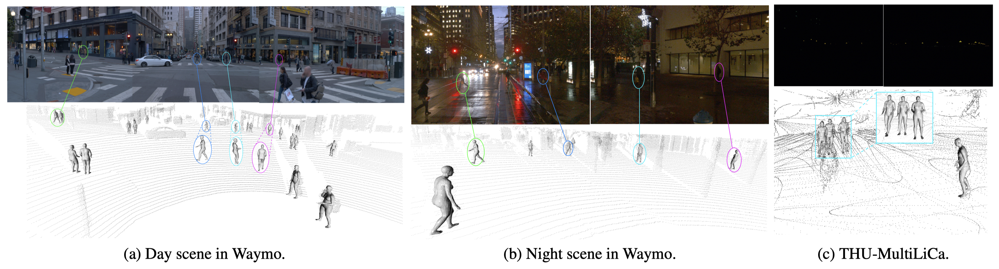

# LiDAR is all you need

### Info

> Title (Master's thesis)

> [Alejandro Cortijo](https://cortijo02.github.io/), ....

## Demo



## Introduction

In recent years, point cloud perception tasks have gained increasing attention due to their relevance in various computer vision applications, such as 3D reconstruction, autonomous navigation, and human-machine interaction. This master's thesis aims to push the state of the art (SOTA) in estimating 3D human body meshes from sparse LiDAR point clouds, contributing new algorithms with the purpose of improve model accuracy and robustness. 

.......

## Steps to Deploy the Current Dockerfile

1. Build the Docker image:

To build and run the Docker container, follow these steps:

```
docker build -t repo_tfm .
```
2. Run the container with GPU support:

Linux:
```
docker run -it --gpus all --name tfm \
  -v $(pwd)/data:/app/data \
  -v $(pwd)/weights:/app/weights \
  -v $(pwd)/smplx_models:/app/smplx_models \
  repo_tfm
```

Windows (Powershell):
```
docker run -it --gpus all --name tfm `
  -v ${PWD}/data:/app/data `
  -v ${PWD}/weights:/app/weights `
  -v ${PWD}/smplx_models:/app/smplx_models `
  repo_tfm
````

3. Use the container:

````
docker exec -it $CONTAINER_ID$ bash
````

3.1 Compile pointops inside the container:

TODO: try to compile during the build

````
cd /app/pointops && python setup.py install --user && cd /app
````

To be continued....

## Preparation

TODO: Improve it (add links)

Downloading the SMPL-X model weights from [this website](https://smpl-x.is.tue.mpg.de/) into 'smplx_models' folder.

Several 3D HPE:

* V2V-PoseNet: [Paper](https://arxiv.org/abs/1711.07399)

* LPFormer: [Paper](https://arxiv.org/abs/2306.12525)

* HybrIK: [Paper](https://arxiv.org/abs/2011.14672) & [Code](https://github.com/jeffffffli/HybrIK)

* SAHSR: [Paper](https://openaccess.thecvf.com/content_ICCV_2019/html/Jiang_Skeleton-Aware_3D_Human_Shape_Reconstruction_From_Point_Clouds_ICCV_2019_paper.html)

* VoteHMR: [Paper](https://arxiv.org/abs/2110.08729) & [Code](https://github.com/hanabi7/VoteHMR)

* LiDARCap: [Paper](https://arxiv.org/abs/2203.14698) & [Code](https://github.com/jingyi-zhang/LiDARCap)

* Pose2Mesh: [Paper](https://arxiv.org/abs/2008.09047) & [Code](https://github.com/hongsukchoi/Pose2Mesh_RELEASE)

* LiDAR-HMR: [Paper](https://arxiv.org/pdf/2311.11971) & [Code](https://github.com/soullessrobot/LiDAR-HMR/tree/main)

To be continued ......

The corresponding train and test codes are in the 'scripts' folder.

Training:
Edit the corresponding path and variable in the training files.
PRN training:
```
python scripts/pct/train_pct.py --dataset sloper4d --cfg configs/pose/pose_15.yaml
```
LiDAR_HMR training:
```
python scripts/lidar_hmr/train_lidarhmr.py --dataset sloper4d --cfg configs/mesh/sloper4d.yaml --prn_state_dict /path/to/your/file
```
LiDAR_HMR testing:
```
python scripts/lidar_hmr/test_lidarhmr.py --dataset sloper4d --cfg configs/mesh/sloper4d.yaml --state_dict weights/sloper4d/lidar_hmr_mesh.pth
```
## Pretrained Models
[Download link](https://cloud.tsinghua.edu.cn/d/937a4af3a7cb4c5b8e89/)

## Prepare Data Files for Waymov2 Dataset
The mesh groundtruths of the Waymo-v2 dataset are acquired utilizting human pose annotations and point clouds. Download the saved pkl files and move them into ./save_data folder (create one if not exists.) for training and testing in the Waymo-v2 dataset.
[Download link](https://cloud.tsinghua.edu.cn/d/0840c820c33745e58aa7/)

## Related Projects

Our code is based on [Mesh Graphormer](https://arxiv.org/abs/2104.00272), [Point Transformer-V2](https://github.com/Pointcept/PointTransformerV2), and [HybrIK](https://arxiv.org/abs/2011.14672).

## Citation

If you find this project helpful, please consider citing the following paper:
```
@article{fan2023lidar,
    title={LiDAR-HMR: 3D Human Mesh Recovery from LiDAR},
    author={Fan, Bohao and Zheng, Wenzhao and Feng, Jianjiang and Zhou, Jie},
    journal={arXiv preprint arXiv:2311.11971},
    year={2023}
}
```
