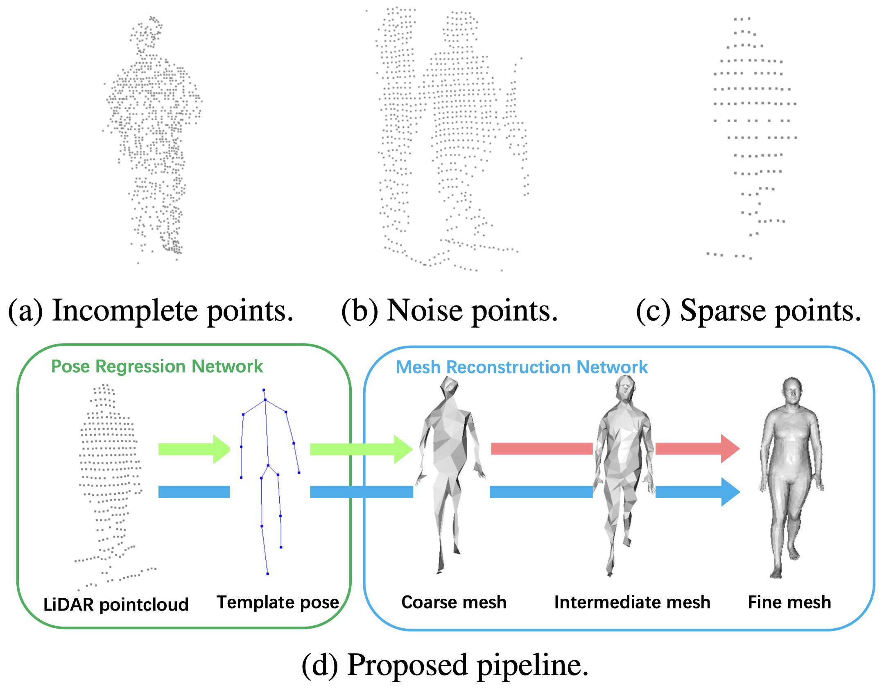
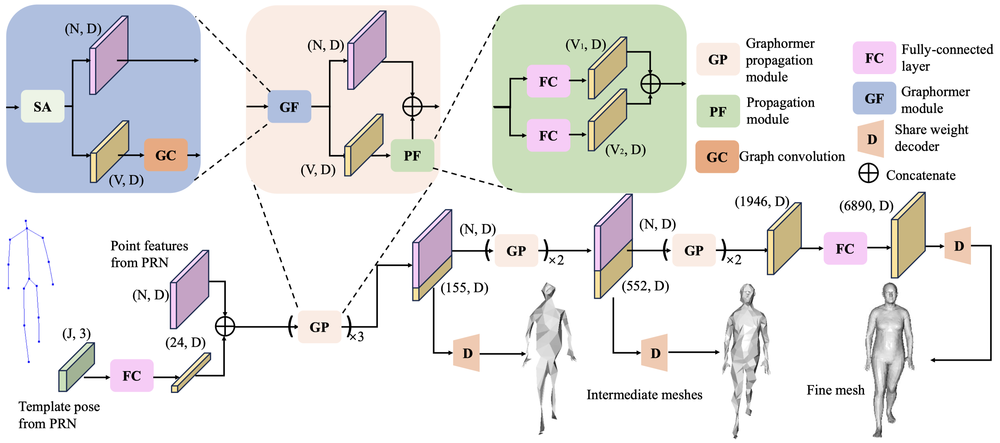
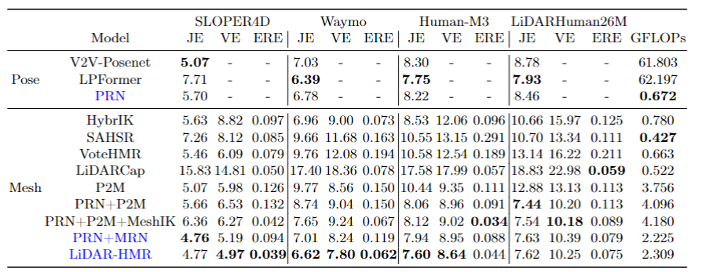
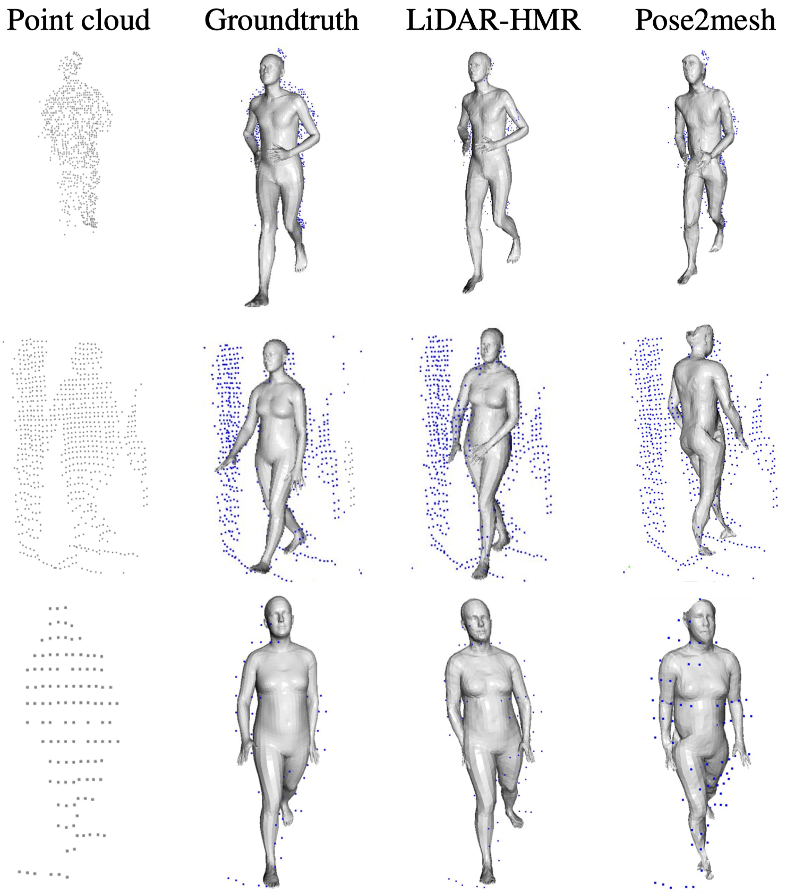

# LiDAR-HMR: 3D Human Mesh Recovery from LiDAR

## Steps to Deploy the Current Dockerfile

1. Build the Docker image:

To build and run the Docker container, follow these steps:

```
docker build -t repo_tfm .
```
2. Run the container with GPU support:

```
docker run -it --gpus all --name tfm repo_tfm bash
```

To be continued....

### Info

> Title (Master's thesis)

> [Alejandro Cortijo](https://cortijo02.github.io/), ....

## Demo


## Introduction

In recent years, point cloud perception tasks have gained increasing attention due to their relevance in various computer vision applications, such as 3D reconstruction, autonomous navigation, and human-machine interaction. This master's thesis aims to push the state of the art (SOTA) in estimating 3D human body meshes from sparse LiDAR point clouds, contributing new algorithms to improve model accuracy and robustness. While previous approaches exist in this domain, the key challenges remain the sparsity, noise, and incompleteness inherent in LiDAR point clouds.

The main focus of this work is to overcome the limitations of sparse point clouds through an innovative sparse-to-dense reconstruction scheme, progressively reconstructing the 3D human mesh from sparse representations. To enhance the integration of 3D structural information from point clouds, a novel approach based on Graph Transformers (Graphormer) is introduced. This improves the reconstruction quality by effectively incorporating the spatial features of the point clouds during the sparse-to-dense process. This repository will serve as a platform to document and showcase the progress made with this approach and its improvements over existing methods, aiming to contribute significantly to the development of more robust and accurate solutions for human mesh reconstruction from LiDAR.

Experimental results on three publicly available datasets validate the effectiveness of the proposed approach, showing significant improvements over current methods. This work not only advances algorithms for 3D reconstruction but also takes a step toward integrating these advancements into real-world applications of point cloud perception and 3D modeling.


### Challenges & Our pipeline



### Framework



### Results



### More Visualizations



## Code
Preparation:
Downloading the SMPL-X model weights from [this website](https://smpl-x.is.tue.mpg.de/) into 'smplx_models' folder.

Installation:
```
pip install -r requirements.txt
```
Install the [Point Transformer-V2](https://github.com/Pointcept/PointTransformerV2) and [ChamferDistancePytorch](https://github.com/ThibaultGROUEIX/ChamferDistancePytorch) following their official documents.

Code:
We have implemented or modified several 3D HPE works based on point cloud including:

V2V-PoseNet: https://arxiv.org/abs/1711.07399

LPFormer: https://arxiv.org/abs/2306.12525

HybrIK: https://arxiv.org/abs/2011.14672

SAHSR: https://openaccess.thecvf.com/content_ICCV_2019/html/Jiang_Skeleton-Aware_3D_Human_Shape_Reconstruction_From_Point_Clouds_ICCV_2019_paper.html

VoteHMR: https://arxiv.org/abs/2110.08729

LiDARCap: https://arxiv.org/abs/2203.14698

Pose2Mesh: https://arxiv.org/abs/2008.09047

The corresponding train and test codes are in the 'scripts' folder.

Training:
Edit the corresponding path and variable in the training files.
PRN training:
```
python scripts/pct/train_pct.py --dataset sloper4d --cfg configs/pose/pose_15.yaml
```
LiDAR_HMR training:
```
python scripts/lidar_hmr/train_lidarhmr.py --dataset sloper4d --cfg configs/mesh/sloper4d.yaml --prn_state_dict /path/to/your/file
```
LiDAR_HMR testing:
```
python scripts/lidar_hmr/test_lidarhmr.py --dataset sloper4d --cfg configs/mesh/sloper4d.yaml --state_dict /path/to/your/file
```
## Pretrained Models
[Download link](https://cloud.tsinghua.edu.cn/d/937a4af3a7cb4c5b8e89/)

## Prepare Data Files for Waymov2 Dataset
The mesh groundtruths of the Waymo-v2 dataset are acquired utilizting human pose annotations and point clouds. Download the saved pkl files and move them into ./save_data folder (create one if not exists.) for training and testing in the Waymo-v2 dataset.
[Download link](https://cloud.tsinghua.edu.cn/d/0840c820c33745e58aa7/)

## Related Projects

Our code is based on [Mesh Graphormer](https://arxiv.org/abs/2104.00272), [Point Transformer-V2](https://github.com/Pointcept/PointTransformerV2), and [HybrIK](https://arxiv.org/abs/2011.14672).

## Citation

If you find this project helpful, please consider citing the following paper:
```
@article{fan2023lidar,
    title={LiDAR-HMR: 3D Human Mesh Recovery from LiDAR},
    author={Fan, Bohao and Zheng, Wenzhao and Feng, Jianjiang and Zhou, Jie},
    journal={arXiv preprint arXiv:2311.11971},
    year={2023}
}
```
